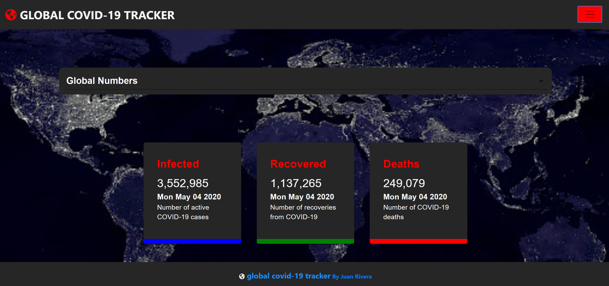

## Global COVID-19 Tracker
```dif - As of 5/6/2020, API source is down. Rendering broken screen.  Needs new API source. ```
- Developer: Juan Rivera
- Date: May 4, 2020

 

*****

## Overview
I've been coding away since I graduated my coding program in March 2020. Somehow, it just hasn't felt right building apps that weren't making an impact during this global pandemic.

Whether this app raises a bit of awareness or helps someone somewhere make a more informed decision, I hope it serves a greater purpose.

Credits:  This project was possible due to the folks at JavaScript Mastery for the awesome tutorial on youtube [here](https://www.youtube.com/watch?v=khJlrj3Y6Ls).  Kudos to them for the great video.

## Installation Steps
1. Git clone with HTTPS to your local machine ```https://github.com/JuanCodeAtATime/covid19-app.git```.
2. In root folder, run ```npm install``` to install back-end dependencies.  
3. Then,  ```cd client``` and run ```npm install``` to install front-end dependencies.  
4. Go back to root directory with ``` cd .. ```.
5. Lastly, run ```npm run start``` to launch in your local machine.

### Future Updates
Cross-browser compatibilty:  As of 5/5/2020, app is currently Chrome and IE11 browser-compatible.  Working to debug issues experienced on Safari iOS platforms.

### Built With
* **Programming Language:** JavaScript 
* **Runtime Evironment/Sever:**  [Node.js](https://nodejs.org/en/)
* **Libraries/Frameworks Used:** [React-Bootstrap](https://react-bootstrap.github.io/), [Material-UI](https://material-ui.com/), [Chart.js](https://www.chartjs.org/), [Reactstrap](https://reactstrap.github.io/)
* **API:** https://covid19.mathdro.id

### Deployed Site
[Click here](https://global-covid-19-tracker.herokuapp.com/) to visit deployed site.


